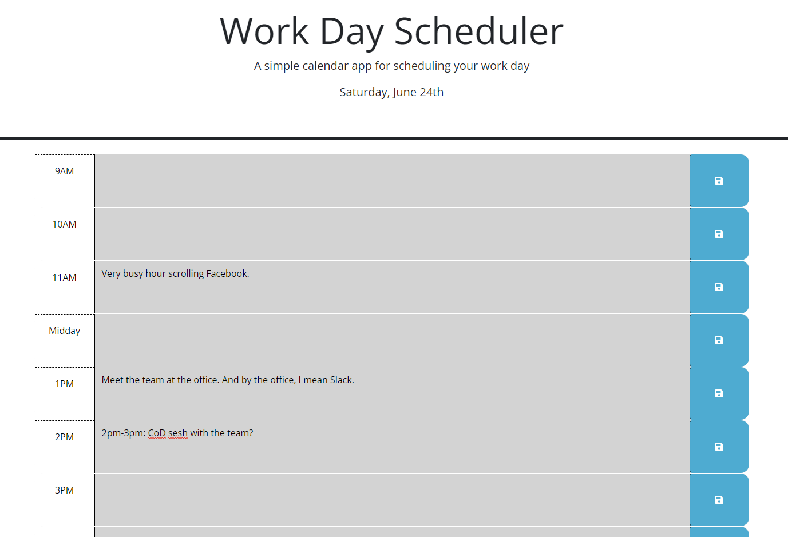

# Daily Scheduler



## Table of Contents

1. [Introduction](#introduction)
2. [Developer Comments](#developer-comments)
3. [Deployed Application](#deployed-application)
4. [Creators](#creators)
5. [License](#license)

## Introduction

This is the Week 5 challenge of the edX/Monash Bootcamp.  The challenge was to create a scheduler based on the Acceptance Criteria as follows:

```md
GIVEN I am using a daily planner to create a schedule
WHEN I open the planner
THEN the current day is displayed at the top of the calendar
WHEN I scroll down
THEN I am presented with time blocks for standard business hours of 9am to 5pm
WHEN I view the time blocks for that day
THEN each time block is color-coded to indicate whether it is in the past, present, or future
WHEN I click into a time block
THEN I can enter an event
WHEN I click the save button for that time block
THEN the text for that event is saved in local storage
WHEN I refresh the page
THEN the saved events persist
```

## Developer Comments
I used the dayjs API to get timing functionality, which I found quite easy to navigate, looks like I'll be using this a lot!  Before this project I wasn't much of a fan of jQuery, but I forced myself to use it, and ended up liking it a lot.  In future projects I'll try going between Vanilla JS and jQuery and see what I like the most.  I refactored my code and started playing with anonymous functions. I like that I can use them as variables, and pass in the parameters that I need. I think it makes my code easier to read, everything looks much neater now!

## Deployed Application

<https://x4ndez.github.io/scheduler/>

## Creators

**Xande** : <https://github.com/x4ndez>

## License

Code released under the MIT License.